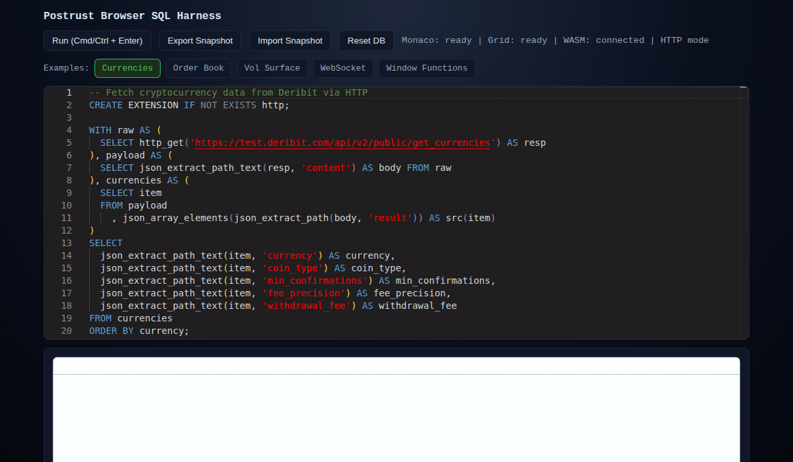
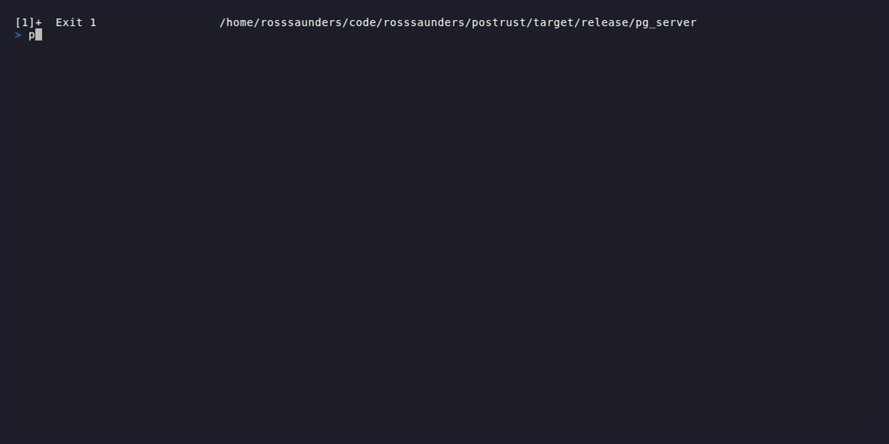

<p align="center">
  
</p>

# OpenAssay

**In-memory PostgreSQL in your browser.**

OpenAssay is a PostgreSQL-compatible SQL engine written in Rust that runs as WebAssembly in the browser and as a native binary. It is built for interactive, in-memory analytics rather than durable storage.

The current codebase explicitly ships and tests:

- `pgvector` via `CREATE EXTENSION vector`
- `json_table(url, ...)` for turning remote JSON into rows
- `iceberg_scan(path)` for scanning local Iceberg tables on native builds

Browser builds expose `execute_sql`, `execute_sql_json`, `execute_sql_arrow`, and state snapshot helpers from `src/browser.rs`. Native builds include a pgwire server, a local web server for the WASM harness, and a terminal UI.

[Try the browser demo](https://rosssaunders.github.io/openassay)

## Demo

### Browser / WASM


### Native / pgwire


## PostgreSQL Compatibility

> The checked-in PostgreSQL 18 compatibility report records `12,329 / 12,329` statements passed.
>
> That denominator comes from the selected corpus under `tests/regression/pg_compat/sql`, which `tests/regression/pg_compat.rs` runs against matching expected outputs in `tests/regression/pg_compat/expected`, plus shared setup. The generated report covers 39 regression SQL files plus setup, not the entire upstream PostgreSQL regression suite.

Additional compatibility evidence in-tree:

- `tests/regression/basic_sql.rs` runs the local SQL corpus fixtures
- `tests/benchmark/clickbench_queries.rs` exercises all 43 ClickBench query shapes
- `tests/benchmark/tpch_queries.rs` exercises all 22 TPC-H query shapes
- `tests/iceberg_tests.rs` exercises native `iceberg_scan(...)` with filters, aggregates, joins, and schema-union cases
- `tests/differential/sql_fixtures.rs` covers a smaller cross-feature SQL fixture set

## Benchmark Comparison

This repository contains reproducible OpenAssay benchmark code and checked-in OpenAssay baselines. It does not contain checked-in DuckDB-WASM, sql.js, or PGlite runs, so this section stays methodology-first instead of inventing a winner.

### What Is Checked In

| Project | Reproducible harness in this repo | Checked-in benchmark output | Notes |
| --- | --- | --- | --- |
| OpenAssay | Yes | Yes | `benches/engine_bench.rs`, `benches/clickbench_bench.rs`, `benches/tpch_bench.rs`, and `benches/baselines/baseline.json` |
| DuckDB-WASM | No | No | No in-repo adapter or imported result artifact |
| sql.js | No | No | No in-repo adapter or imported result artifact |
| PGlite | No | No | No in-repo adapter or imported result artifact |

### OpenAssay Baselines In Tree

- `engine_bench.rs` covers `SELECT 1`, inserts, joins, expression evaluation, and 1k-row aggregates. The harness is committed, but there is no checked-in Criterion baseline JSON for it yet.
- `clickbench_bench.rs` runs 43 ClickBench query shapes over a small inline `hits` seed. The committed baseline stores median point estimates from about `0.734 ms` to `1.058 ms`, plus `clickbench_load` at about `1.184 ms`.
- `tpch_bench.rs` runs 22 TPC-H query shapes over an inline 8-table seed dataset. The committed baseline stores median point estimates from about `0.380 ms` to `7.984 ms`, with `tpch_load` at about `1.396 ms`.

Those numbers are useful for tracking OpenAssay regressions. They are not, by themselves, a fair browser-engine shootout against DuckDB-WASM, sql.js, or PGlite because this repo does not run those engines under the same harness.

To reproduce the workloads that do exist here:

```bash
cargo bench --bench engine_bench
cargo bench --bench clickbench_bench
cargo bench --bench tpch_bench
python3 scripts/compare_benchmarks.py
```

If you want a like-for-like comparison against DuckDB-WASM, sql.js, or PGlite, the honest starting point is `benches/` plus equivalent adapters for the same workloads and environment.

## Quick Start

Requirements:

- Rust toolchain
- `wasm-pack` for the browser build
- `psql` if you want to use the pgwire example

### Browser / WASM

Build the WASM package and serve the browser harness:

```bash
scripts/build_wasm.sh
cargo run --bin web_server -- 8080
```

Open `http://127.0.0.1:8080`.

Call the generated module directly:

```js
import init, { execute_sql_json } from "./web/pkg/openassay.js";

await init();

const payload = JSON.parse(await execute_sql_json(`
  CREATE EXTENSION vector;
  CREATE TABLE items (id int8, embedding vector(3));
  INSERT INTO items VALUES
    (1, '[1,2,3]'),
    (2, '[4,5,6]');

  SELECT id, embedding <-> '[1,2,3]' AS distance
  FROM items
  ORDER BY distance
  LIMIT 1;
`));

console.log(payload.results.at(-1));
```

### Native pgwire server

Start the PostgreSQL wire-protocol server and connect with any PG client:

```bash
cargo run --bin pg_server -- 127.0.0.1:55432
psql -h 127.0.0.1 -p 55432
```

### Optional local TUI

Run the terminal UI from an interactive shell:

```bash
cargo run --bin tui
```

### Example SQL

`pgvector` nearest-neighbor search:

```sql
CREATE EXTENSION vector;

CREATE TABLE items (
  id int8,
  embedding vector(3)
);

INSERT INTO items VALUES
  (1, '[1,2,3]'),
  (2, '[4,5,6]');

SELECT id, embedding <-> '[1,2,3]' AS distance
FROM items
ORDER BY distance
LIMIT 2;
```

`json_table` over live HTTP JSON:

```sql
SELECT *
FROM json_table(
  'https://www.deribit.com/api/v2/public/get_currencies',
  'result'
)
ORDER BY currency;
```

Native-only Iceberg scan:

```sql
SELECT instrument, count(*), avg(price) AS avg_price
FROM iceberg_scan('/path/to/iceberg/table')
GROUP BY instrument
ORDER BY instrument;
```

## Feature Matrix

Broad comparison against DuckDB-WASM, sql.js, and PGlite. OpenAssay entries are backed by code and tests in this repository. Other columns stay conservative; `?` means "not verified from this repo, check upstream docs before depending on it."

| Capability | OpenAssay | DuckDB-WASM | sql.js | PGlite |
| --- | --- | --- | --- | --- |
| Runs fully in the browser | Yes | Yes | Yes | Yes |
| PostgreSQL-compatible SQL is a primary surface | Yes | No | No | Yes |
| Native pgwire server shipped by the project | Yes | No | No | No |
| Built-in `pgvector` | Yes | ? | ? | ? |
| Built-in `json_table(url, ...)` helper | Yes | ? | ? | ? |
| Built-in `iceberg_scan(...)` helper | Yes, native builds | ? | ? | ? |

## What It Ships

- Browser/WASM API in `src/browser.rs`
- `pg_server` in `src/bin/pg_server.rs`
- `web_server` in `src/bin/web_server.rs`
- `tui` in `src/bin/tui.rs`
- JSON/JSONB functions in `src/utils/adt/json.rs`
- `pgvector` distance operators and helper functions in `src/extensions/pgvector.rs`
- Native Iceberg table reads exercised by `tests/iceberg_tests.rs`

## Scope

OpenAssay is best understood as a PostgreSQL-flavored query engine:

- data lives in memory
- browser builds call the engine directly through WASM exports
- native builds add pgwire, local web serving, and native-only features such as `iceberg_scan(...)`
- it is not trying to reproduce WAL, vacuum, or full PostgreSQL storage-engine semantics

## Development

```bash
cargo test
cargo clippy -- -D warnings
```

Useful browser-specific notes are in [`web/README.md`](web/README.md). PostgreSQL regression harness notes are in [`tests/regression/pg_compat/README.md`](tests/regression/pg_compat/README.md).

## License

MIT
